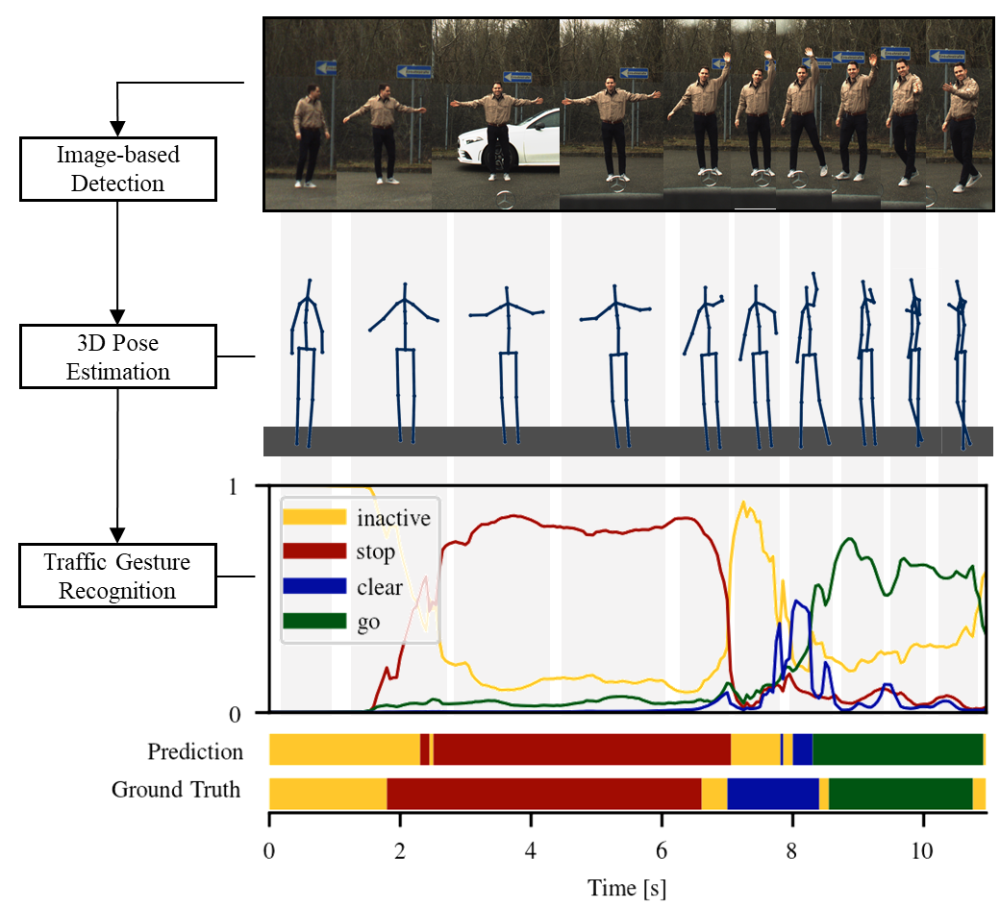

# Traffic Control Gesture Recognition for Autonomous Vehicles

This is the official project page including paper link, code, baseline models and dataset.

**[Traffic Control Gesture Recognition for Autonomous Vehicles](https://arxiv.org/abs/2007.16072)**
<br>
Julian Wiederer*, Arij Bouazizi*, Ulrich Kressel, Vasileios Belagiannis
<br>
*Accepted for oral presentation at [IROS 2020 oral](https://www.iros2020.org/)*
<br>
**denotes equal contribution*

<!------>

<div align="center">

</div>

### Requirements

List of packages used to train and test the models (see also requirements.txt).
```
h5py==2.10.0
tensorflow==2.0.0
Keras==2.3.1
matplotlib==3.3.1
numpy==1.17.2
tqdm==4.48.2
keras_self_attention==0.42.0
scikit_learn==0.23.2
```

### Dataset

##### Requesting Access
To optain the TCG dataset (around 650 MB), please send an email to *tcg.recognition@gmail.com* with subject matter
'[IROS2020] TCG Dataset - Access Request' stating the following:

&nbsp;&nbsp;&nbsp;&nbsp;&nbsp;&nbsp; *Your name, title and affiliation*
<br>
&nbsp;&nbsp;&nbsp;&nbsp;&nbsp;&nbsp; *Your intended use of the data*
<br>
&nbsp;&nbsp;&nbsp;&nbsp;&nbsp;&nbsp; The following license statement:
<br>
&nbsp;&nbsp;&nbsp;&nbsp;&nbsp;&nbsp; *With this e-mail I agree that I will use the TCG dataset following the Creative 
Common Attribution-NonCommercial 4.0 International License.*

We will promptly reply with a download link. 
Download the .zip file and copy it into `dataset`. Unzip using

```
cd dataset
unzip tcg_dataset.zip
```

##### License

<a rel="license" href="http://creativecommons.org/licenses/by-nc/4.0/">
</a><br />TCG dataset is licensed under <a rel="license" href="http://creativecommons.org/licenses/by-nc/4.0/"
 >Creative Commons Attribution-NonCommercial 4.0 International License</a>.

##### Content
The dataset includes two files, the description file with all required meta information and annotations *tcg.json* 
and the data file *tcg_data.npy* with the 3D pose sequences.

### Baseline Models

Download the baseline models from google drive and unzip the .zip file in the baselines directory:

https://drive.google.com/file/d/1Kz-7PpSkucCSBWcrL9K3fTotxhNgWAaa/view?usp=sharing

### Training

Make sure the requirements are satisfied in your environment, and the dataset is downloaded. 
Change configuration and hyperparameters in /config/config.py as you like and run 

```
python config.py
```

to initialize config.ini. Then  run

```
python main.py 
```
You can also play with the hyperparameters using the /config/config.py. 


### Evaluation

To reproduce the quantitative results in our paper, run the provided script:
```
python evaluate.py
```


### Citation
We believe in open research and we will be happy if you find this dataset usefull for your work. 
If you use it, please consider citing our [work](https://arxiv.org/abs/2007.16072).

```latex
@InProceedings{wiederer2020traffic,
               title={Traffic Control Gesture Recognition for Autonomous Vehicles}, 
               author={Julian Wiederer and Arij Bouazizi and Ulrich Kressel and Vasileios Belagiannis},
               year={2020},
               booktitle={ArXiv preprint}
}
```

### Contact
If you have any questions feel free to contact **julian.wiederer@uni-ulm.de**.

